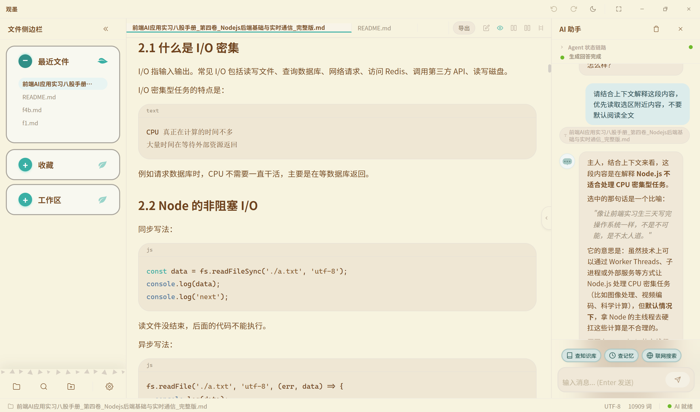
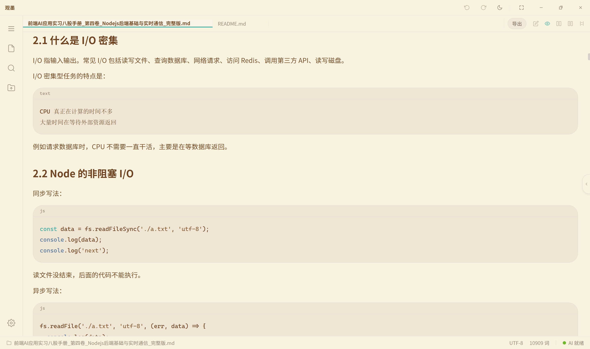
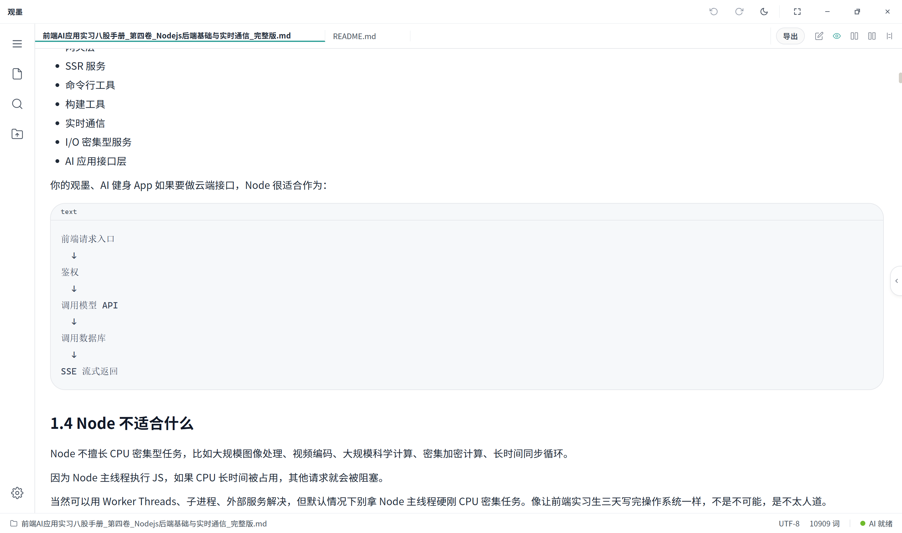
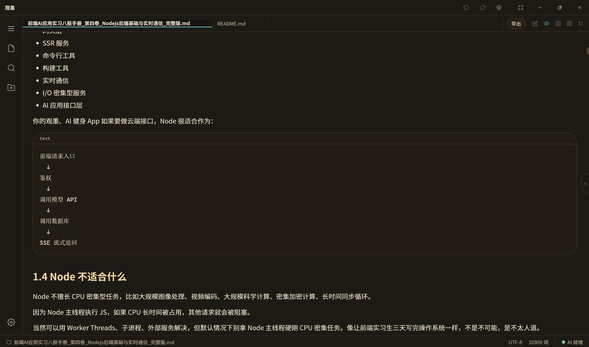
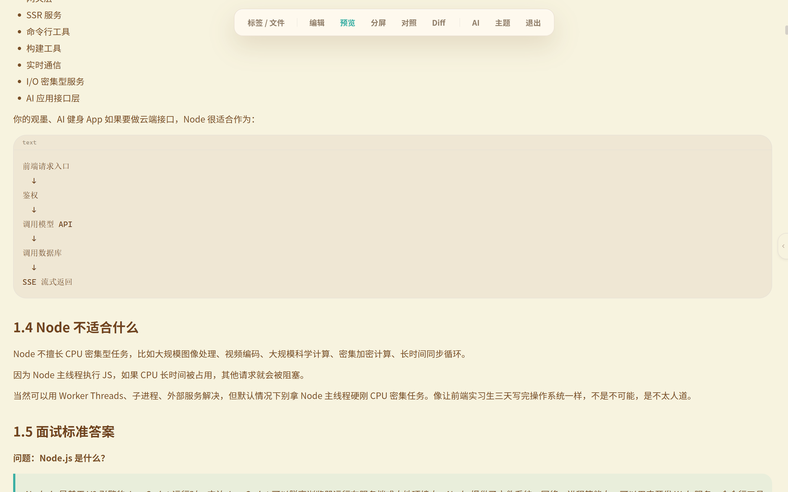
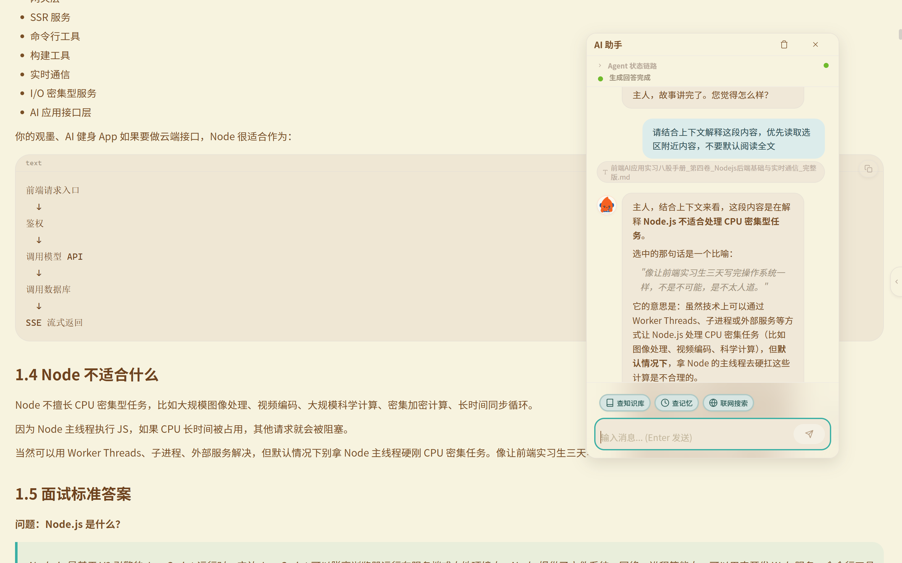

<p align="center">
  
</p>

<h1 align="center">观墨 · GuanMo</h1>

<p align="center">
  <strong>AI 驱动的 Markdown 知识管理桌面应用</strong><br/>
  <sub>An AI-powered Markdown knowledge management desktop application</sub>
</p>

<p align="center">
  
  
  
  
  
</p>

## 📥 下载 · Download

<table align="center">
  <tr>
    <td><b>🪟 Windows</b></td>
    <td>
      <a href="https://github.com/we-used-to-be/Guanmo-open/releases/latest"><b>⬇ 下载安装包</b></a><br/>
      <sub>提供 NSIS (<code>.exe</code>) 和 WiX (<code>.msi</code>) 安装程序</sub>
    </td>
  </tr>
  <tr>
    <td><b>🌐 网页版</b></td>
    <td>
      <a href="https://we-used-to-be.github.io/Guanmo-page/"><b>在线体验</b></a><br/>
      <sub>浏览器环境下仅可体验编辑、预览等基础md功能。文件系统、自动保存、AI助手、知识库、长期记忆等桌面功能不可用，样式和交互可能与桌面版存在差异</sub>
    </td>
  </tr>
  <tr>
    <td><b>🍎 macOS</b></td>
    <td>
      <sub>暂不提供预编译版本，请自行打包测试（参考下方 <a href="#-快速开始-quick-start">快速开始</a>）</sub>
    </td>
  </tr>
</table>

---

<p align="center">
  <a href="#-功能特性-features">功能特性</a> ·
  <a href="#-主题切换-themes">主题</a> ·
  <a href="#-全屏专注模式-focus-mode">专注模式</a> ·
  <a href="#-使用说明-user-guide">使用说明</a> ·
  <a href="#-快速开始-quick-start">快速开始</a> ·
  <a href="#%EF%B8%8F-技术栈-tech-stack">技术栈</a> ·
  <a href="#-项目结构-project-structure">项目结构</a> ·
  <a href="#-快捷键-shortcuts">快捷键</a> ·
  <a href="#-许可证-license">许可证</a>
</p>

---

## 📖 简介 · Introduction

**观墨**（GuanMo）是一款本地优先的 AI Markdown 知识管理应用。它把多文档编辑、公式与图表预览、本地 RAG、长期记忆和可控 Agent 工具整合在同一工作区，让 AI 能围绕用户明确提供的文件、文件夹和选区上下文完成阅读、问答与编辑。

观墨的定位不是构建复杂的插件生态或大型知识图谱系统，而是提供一个轻量、开箱即用、AI 原生的 Markdown 工作区。

它更关注本地文档的阅读、编辑、对照、比较和 AI 辅助处理，让用户少折腾配置，把更多注意力放回内容本身。

桌面版基于 [Tauri 2](https://v2.tauri.app/)；浏览器模式可用于体验编辑、预览和 AI 对话，并会明确标示文件系统、自动保存、知识库与长期记忆等桌面专属能力。

---

## 🖼 软件截图 · Screenshot

<p align="center">
  
</p>

---

## 🎨 主题切换 · Themes

<p align="center">
  <table align="center">
    <tr>
      <td align="center"><b>🌞 暖色主题</b></td>
      <td align="center"><b>☀️ 浅色主题</b></td>
      <td align="center"><b>🌙 深色主题</b></td>
    </tr>
    <tr>
      <td></td>
      <td></td>
      <td></td>
    </tr>
  </table>
</p>

---

## 🎯 全屏专注模式 · Focus Mode

全屏模式隐藏标题栏与侧边栏，提供纯净的阅读与编辑空间。鼠标移至顶部唤起隐藏式控制条，支持快速切换编辑 / 预览 / Diff 视图；AI 助手以弹窗形式即用即走，不影响沉浸体验。

<p align="center">
  <table align="center">
    <tr>
      <td align="center"><b>隐藏式控制条</b><br/><sub>鼠标移至顶部唤起，支持视图切换、文件导航、主题切换</sub></td>
      <td align="center"><b>即用即走 AI 助手</b><br/><sub>弹窗形式，点击外部自动关闭，拖动顶部调节位置</sub></td>
    </tr>
    <tr>
      <td></td>
      <td></td>
    </tr>
  </table>
</p>

---

## 🔐 安全提醒 · Security Notes

- Tauri FS 权限默认不开放全盘访问；文件读写仅限用户通过对话框显式选择的工作区目录或单个文件。
- Rust 兜底文件命令会校验绝对路径、文本或图片文件扩展名，并拒绝访问未授权 workspace 之外的路径。
- 本开源副本不内置任何 API Key。API Key 通过应用设置填写，并由 Windows DPAPI 加密后保存在本机。
- `.env` 只用于配置本机密钥存储中的标识名，不应写入真实 API Key。请从 `.env.example` 创建本地 `.env`，并且不要提交 `.env`、数据库文件或历史记录。

示例环境变量：

```bash
VITE_GUANMO_AI_API_KEY_SECRET=guanmo.ai.api-key
VITE_GUANMO_EMBEDDING_API_KEY_SECRET=guanmo.embedding.api-key
VITE_GUANMO_WEB_SEARCH_API_KEY_SECRET=guanmo.web-search.api-key
```

---

## ✨ 功能特性 · Features

### 📝 编辑、预览与导出

- CodeMirror 6 编辑器，支持多标签页、搜索替换、自动保存和会话恢复。
- 编辑、预览、并排、双文档与 Diff 视图；编辑和预览共用阅读位置并支持同步滚动。
- 全屏专注模式提供独立控制栏，鼠标移至顶部唤起，可快速切换编辑 / 预览 / Diff 视图，并通过"标签 / 文件"或 `Ctrl+B` 打开全屏文件侧边栏。全屏模式下 AI 助手改为小窗模式，拖动顶部调节位置，点击外部关闭弹窗，实现即用即走。
- 支持 GFM、代码高亮、可交互任务列表、目录导航和 Mermaid 图表。
- KaTeX 统一处理行内公式、独立公式块及常见 LaTeX 定界符，并保持预览、选区和 HTML 导出的格式一致。
- 支持选择、拖拽和粘贴图片，自动生成相对资源路径；支持一键导出 HTML。

### 🤖 AI Agent 与语义上下文

- 支持 OpenAI 兼容接口及 Ollama 等本地模型，流式展示回答与 Agent 执行时间线。
- 根据请求规则裁剪候选工具，再由模型选择实际工具；知识库、记忆、联网搜索和文件操作各自保持明确边界。
- 文件、文件夹和 selection tag 均可作为本轮上下文；修改操作必须具有本轮新授权并经用户确认。
- `read_selection_context` 会围绕当前选区读取完整语义原子：Level 1 最多 700 tokens，仅在信息不足时递进到累计 1400 tokens 的 Level 2，避免直接发送全文。
- RAG 与选区阅读共用 AST 语义分块，保留标题、段落、列表、引用、代码、公式和表格边界。
- 本地知识库支持批量索引、向量检索、队列状态、失效清理和重建；长期记忆支持提取、确认、锁定与搜索。
- 支持 DuckDuckGo、Brave Search 和自定义搜索服务，并提供自定义提示词。

### 🗂 本地文件与工作区

- 工作区文件树、最近文件、收藏夹、重命名、另存为和多标签页管理。
- 启动时恢复上次会话；支持双击、拖放 `.md` 文件打开并唤回应用窗口。
- 文件访问受用户选择的工作区或单文件授权约束，知识库索引和应用数据保存在本机。
- AI 功能由用户自行配置模型接口，不内置密钥，也不要求上传本地文档。

### 🌐 浏览器模式

- 可体验 Markdown 编辑、预览、公式、图表与 AI 对话。
- 最近文件、收藏夹、工作区、自动保存、知识库和长期记忆依赖桌面能力，在浏览器中会禁用并显示说明。
- 浏览器模式不会用下载行为模拟自动保存，避免产生意外文件。

### ⚙️ 配置与数据

- AI 与 Embedding 模型独立配置，支持暖色 / 浅色 / 深色主题及编辑器显示设置。新增 AI 吉祥物头像选项和模式闲时预热设置。
- 支持记忆管理、知识库状态查看，以及应用数据的导出和导入。

---

## 📚 使用说明 · User Guide

完整的安装、配置与功能使用指南请查阅 **[观墨使用说明书](docs/USER_GUIDE.md)**，涵盖界面总览、文件管理、编辑预览、AI 助手、知识库、长期记忆、联网搜索、外观设置、快捷键和常见问题等内容。

---

## 🛠️ 技术栈 · Tech Stack

| 层级 | 技术 |
|------|------|
| **桌面壳** | Tauri 2 (Rust) |
| **前端框架** | React 18 + TypeScript 5.7 |
| **构建工具** | Vite 6 |
| **编辑器** | CodeMirror 6 |
| **状态管理** | Zustand 5（4 个持久化 Store） |
| **样式** | Tailwind CSS 3.4 + 自定义设计令牌 |
| **UI 组件库** | Animal Island UI |
| **数据库** | SQLite（Tauri SQL 插件） |
| **Markdown 渲染** | react-markdown + remark-gfm + rehype-katex + rehype-highlight |
| **图表** | Mermaid |
| **数学公式** | KaTeX |
| **安全** | Windows DPAPI 加密存储 API Key |

---

## 🚀 快速开始 · Quick Start

### 环境要求 · Prerequisites

- [Node.js](https://nodejs.org/) >= 18
- [Rust](https://www.rust-lang.org/) (stable)
- [Tauri 2 CLI](https://v2.tauri.app/start/prerequisites/) 依赖

### 安装 · Installation

```bash
# 克隆仓库 · Clone the repo
git clone https://github.com/we-used-to-be/Guanmo-open.git
cd Guanmo-open

# 安装前端依赖 · Install frontend dependencies
npm ci

# 创建本机配置文件，文件中仅包含密钥标识名，不包含真实 API Key
# Create local config with secret identifiers only, never real API keys
cp .env.example .env
```

### 开发 · Development

```bash
# 推荐：Tauri 开发模式（直接在 WebView 中运行，资源路径问题立即暴露）
# Recommended: Tauri dev mode (runs in WebView, path issues surface immediately)
npm run tauri dev

# 仅前端 Vite 开发服务器 · Frontend-only Vite dev server
npm run dev
```

### 构建 · Build

```bash
# TypeScript 检查 + Vite 构建 · TypeScript check + Vite build
npm run build

# 完整 Tauri 构建（生成 .exe）· Full Tauri build (produces .exe)
npm run tauri build
```

### 测试 · Testing

```bash
# Agent 解析器测试 · Agent parser tests
npm run test:agent-parser

# Markdown 数学公式测试 · Markdown math tests
npm run test:markdown-math

# 资源路径检查 · Resource path check
npm run check:paths
```

---

## 📁 项目结构 · Project Structure

```
guanmo/
├── src/
│   ├── components/
│   │   ├── ai/                 # AI 聊天面板、提示词编辑器
│   │   │                     # AI chat panel, prompt composer
│   │   ├── editor/             # CodeMirror 编辑器、预览、Diff、标签栏
│   │   │                     # CodeMirror editor, preview, diff, tab bar
│   │   ├── file-tree/          # 文件树组件
│   │   │                     # File tree component
│   │   ├── layout/             # 应用布局：标题栏、侧边栏、状态栏
│   │   │                     # App layout: title bar, sidebar, status bar
│   │   └── common/             # 通用组件：命令面板、右键菜单、Toast
│   │                         # Common: command palette, context menu, toast
│   ├── services/
│   │   ├── agent/              # Agent 系统：意图检测、工具选择、执行器
│   │   │                     # Agent: intent detection, tool selection, executor
│   │   ├── ai/                 # AI 客户端、流式处理、模型预设
│   │   │                     # AI client, streaming, model presets
│   │   ├── rag/                # RAG 管道：分块、嵌入、向量存储、检索
│   │   │                     # RAG pipeline: chunking, embedding, vector store
│   │   ├── memory/             # 长期记忆服务
│   │   │                     # Long-term memory service
│   │   └── database/           # SQLite 初始化、Schema、CRUD
│   │                         # SQLite init, schema, persistence
│   ├── stores/                 # Zustand 状态管理（app / editor / chat / settings）
│   │                         # Zustand stores (app / editor / chat / settings)
│   ├── hooks/                  # 自定义 Hooks：AI 聊天、文件操作、快捷键
│   │                         # Custom hooks: AI chat, file ops, keyboard
│   ├── features/               # 功能模块：设置页面
│   │                         # Feature modules: settings page
│   ├── styles/                 # 全局样式 + 主题令牌（亮色 / 暗色 / 动物暗色）
│   │   └── tokens/             # 主题设计令牌：light.css / dark.css / animal-dark.css
│   │                         # Global styles + theme tokens (light / dark / animal-dark)
│   └── vendor/                 # 内置 UI 组件库：Animal Island UI
│                             # Vendored UI library: Animal Island UI
├── src-tauri/
│   ├── src/lib.rs              # Rust 后端：DPAPI 加密、文件操作命令
│   │                         # Rust backend: DPAPI encryption, file commands
│   ├── Cargo.toml
│   └── tauri.conf.json         # Tauri 配置
│                             # Tauri configuration
├── scripts/                    # 工具脚本（路径检查、Agent 解析器测试）
│                             # Utility scripts (path check, agent parser test)
└── docs/                       # 项目文档
                              # Project documentation
```

---

## ⌨️ 快捷键 · Shortcuts

| 快捷键 | 功能 |
|--------|------|
| `Ctrl + N` | 新建文件 |
| `Ctrl + O` | 打开文件 |
| `Ctrl + S` | 保存 |
| `Ctrl + Shift + S` | 另存为 |
| `Ctrl + F` | 搜索替换 |
| `Ctrl + J` | 切换 AI 助手面板 |
| `Ctrl + B` | 切换侧边栏 |
| `Ctrl + P` | 命令面板（文件） |
| `Ctrl + Shift + P` | 命令面板（命令） |
| `Ctrl + Shift + E` | 导出为 HTML |
| `F11` | 切换全屏专注模式 |
| `Ctrl + Shift + 1 ~ 5` | 快速切换编辑视图模式 |
| `Ctrl + 滚轮` | 调整编辑器字号 |
| `Ctrl + Tab` | 切换标签页 |

---

## 🤝 贡献 · Contributing

欢迎提交 Issue 和 Pull Request！

Contributions are welcome! Feel free to open issues and submit pull requests.

1. Fork 本仓库
2. 创建功能分支 (`git checkout -b feature/amazing-feature`)
3. 提交更改 (`git commit -m 'feat: add amazing feature'`)
4. 推送到分支 (`git push origin feature/amazing-feature`)
5. 创建 Pull Request

---

## 📦 发布 · Release

推送 `v*` 格式的 tag 会触发 GitHub Actions，在 Windows 上构建 Tauri 应用、创建 GitHub Release，并上传 NSIS `.exe` 与 WiX `.msi` 安装包。安装包不会提交到 Git 仓库。

```bash
git tag -a v1.2.3
git push origin v1.2.3
```

发布 tag 应与 `package.json`、`src-tauri/Cargo.toml` 和 `src-tauri/tauri.conf.json` 中的版本号保持一致。

---

## 🧩 第三方组件与品牌说明 · Third-party Notices

- 本项目 vendored 了 [animal-island-ui](https://github.com/guokaigdg/animal-island-ui) 的组件快照，并保留其 MIT 许可证。
- animal-island-ui 上游 README 同时包含非商业使用说明，该说明与 MIT LICENSE 的授权范围存在表述差异；计划商业分发前请自行核对上游条款。
- 观墨不是 Nintendo 官方产品，与 Nintendo Co., Ltd. 无关联、授权或合作关系。
- 完整归属与许可说明见 [`THIRD_PARTY_NOTICES.md`](THIRD_PARTY_NOTICES.md)。

---

## Disclaimer

Guanmo is provided as a Markdown editing and AI assistance tool on an "AS IS" basis. Users are responsible for backing up important data and reviewing AI-generated content before use. For details, see [DISCLAIMER.md](DISCLAIMER.md).

---

## 📄 许可证 · License

观墨项目原创代码基于 MIT 许可证开源。第三方代码与资源仍受各自许可证和条款约束。

Guanmo's original code is licensed under the MIT License. Third-party code and assets remain subject to their respective licenses and terms.

---

<p align="center">
  <sub>用 ❤️ 和 ☕ 打造 · Built with ❤️ and ☕</sub>
</p>
