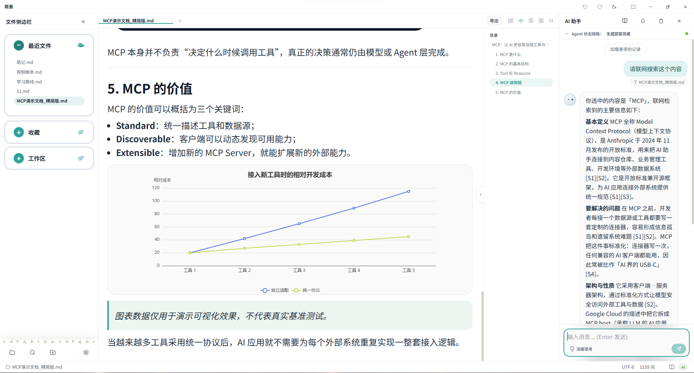
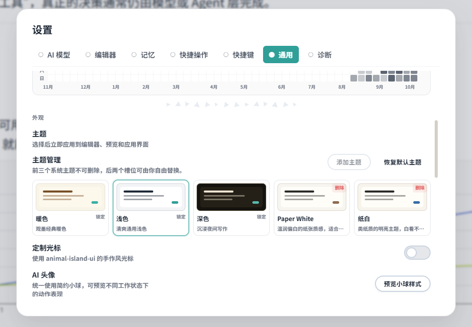
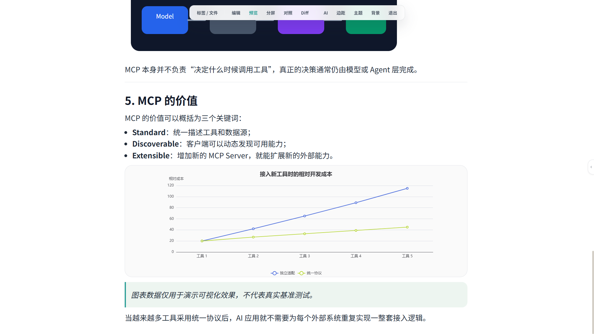
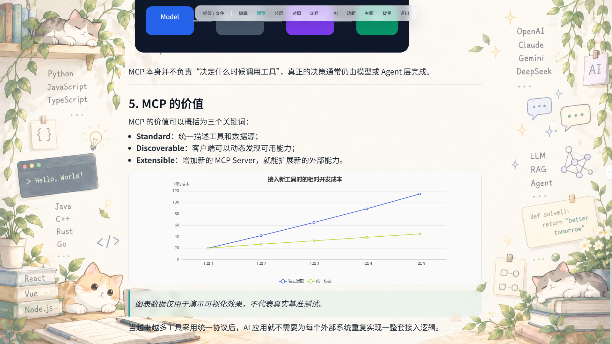
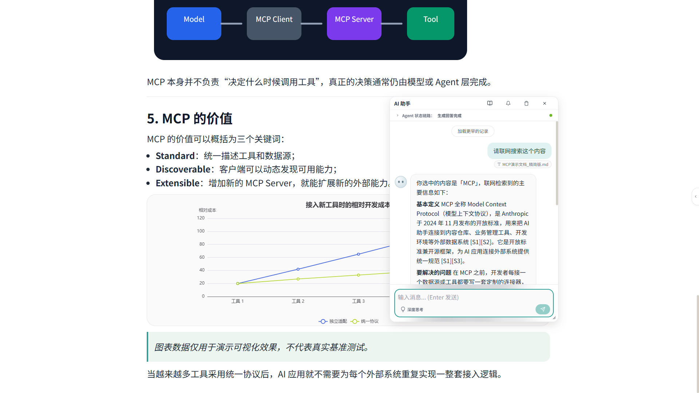
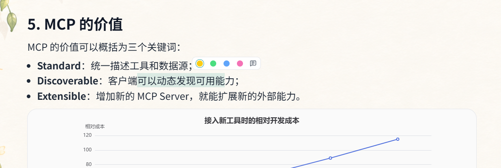
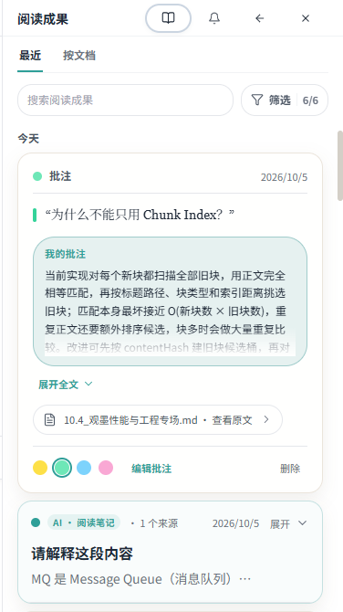

<p align="center">
  
</p>

<h1 align="center">观墨 · GuanMo</h1>

<p align="center">
  <strong>让 Markdown 文档更易阅读、更易理解、更易创作</strong><br/>
  <sub>A Markdown workspace for better reading, understanding, and writing</sub>
</p>

<p align="center">
  
  
  
  
  
</p>

## 📥 下载 · Download

<table align="center">
  <tr>
    <td><b>🪟 Windows</b></td>
    <td>
      <a href="https://github.com/we-used-to-be/Guanmo-open/releases/latest"><b>⬇ 下载安装包</b></a><br/>
      <sub>提供 NSIS (<code>.exe</code>) 和 WiX (<code>.msi</code>) 安装程序</sub><br/><br/>
      <a href="https://apps.microsoft.com/detail/9N2C2C3ZS467?mode=direct&cid=DevShareMCLPCS">
        
      </a><br/>
      <sub>微软商店版本更新频率会慢一些</sub>
    </td>
  </tr>
  <tr>
    <td><b>🌐 网页版</b></td>
    <td>
      <a href="https://we-used-to-be.github.io/Guanmo-page/"><b>在线体验</b></a><br/>
      <sub>支持 Markdown 编辑、预览与基础 AI 对话；文件操作取决于浏览器授权与兼容性。知识库、长期记忆及持久聊天历史仅在桌面版提供</sub>
    </td>
  </tr>
  <tr>
    <td><b>🍎 macOS</b></td>
    <td>
      <sub>暂不提供预编译版本，请自行打包测试（参考下方 <a href="#-快速开始-quick-start">快速开始</a>）</sub>
    </td>
  </tr>
</table>

---

<p align="center">
  <a href="#主打的使用体验">产品定位</a> ·
  <a href="#-软件截图-screenshot">截图</a> ·
  <a href="#-功能特性-features">功能特性</a> ·
  <a href="#-使用说明-user-guide">使用说明</a> ·
  <a href="#-快速开始-quick-start">快速开始</a> ·
  <a href="#%EF%B8%8F-技术栈-tech-stack">技术栈</a> ·
  <a href="#-项目结构-project-structure">项目结构</a> ·
  <a href="#-快捷键-shortcuts">快捷键</a> ·
  <a href="#license-and-trademark">许可证与品牌声明</a>
</p>

---

## 📖 简介 · Introduction

**GuanMo 是以阅读与 AI 辅助理解为重点的 Markdown 工作空间，同时支持编辑、批注和导出。**

### 主打的使用体验

- **长文档阅读**：按可视区域渲染预览，适合技术文档、学习资料和书籍笔记。
- **沉浸式全屏**：隐藏标题栏与侧边栏，可调整背景、主题和正文边距。
- **AI 即选即问**：围绕选区及上下文提问，可结合知识库或联网搜索；修改原文需用户确认。
- **预览内原地编辑**：按 `Alt + 左键` 点击目标块，直接编辑对应 Markdown 源码。
- **高亮与批注**：标记重点、记录想法，并在阅读成果中统一回看个人记录与 AI 成果。

---

## 🖼 软件截图 · Screenshot

### 主界面

文件侧边栏、Markdown 预览、目录导航与 AI 助手。

<p align="center">
  
</p>

<table align="center">
  <tr>
    <td align="center"><b>主题管理</b><br/><sub>选择主题，管理可替换的自定义主题</sub></td>
    <td align="center"><b>全屏阅读</b><br/><sub>鼠标移至顶部唤起控制条</sub></td>
  </tr>
  <tr>
    <td width="50%"></td>
    <td width="50%"></td>
  </tr>
</table>

### 全屏阅读背景

启用背景后的阅读效果；可通过顶部“背景”入口选择场景、导入本地图片和调节图片可见度。

<p align="center">
  
</p>

### 全屏 AI 小窗

在全屏阅读中打开 AI 助手，以小窗查看回答并继续提问。

<p align="center">
  
</p>

### 高亮与批注

选中原文后，通过工具条选择高亮颜色或添加文字批注。

<p align="center">
  
</p>

### 阅读成果

集中查看手动批注与 AI 阅读笔记，支持搜索、筛选、编辑批注和查看原文。

<p align="center">
  
</p>

---

## 🔐 安全提醒 · Security Notes

- 本开源副本不内置任何 API Key。API Key 通过应用设置填写，并由 Windows DPAPI 加密后保存在本机。
- `.env` 只用于配置本机密钥存储中的标识名，不应写入真实 API Key。请从 `.env.example` 创建本地 `.env`，并且不要提交 `.env`、数据库文件或历史记录。
- 数据访问、第三方服务与用户控制说明见 [隐私政策](PRIVACY.md)。

示例环境变量：

```bash
VITE_GUANMO_AI_API_KEY_SECRET=guanmo.ai.api-key
VITE_GUANMO_EMBEDDING_API_KEY_SECRET=guanmo.embedding.api-key
VITE_GUANMO_WEB_SEARCH_API_KEY_SECRET=guanmo.web-search.api-key
```

---

## ✨ 功能特性 · Features

### 📝 编辑、预览与导出

- CodeMirror 6 编辑器，支持多标签页、搜索替换、自动保存、会话恢复和标签页状态持久化。
- 编辑、预览、并排、双文档与 Diff 视图，编辑和预览共用阅读位置并支持同步滚动。
- `Alt + 左键` 点击预览内 Markdown 块即可原地编辑，无需手动定位。
- 支持 GFM、代码高亮、可交互任务列表、目录导航、Mermaid / ECharts 图表和内嵌 HTML 渲染。
- KaTeX 统一处理行内公式与独立公式块，保持预览、选区和 HTML 导出格式一致。
- 支持选择、拖拽和粘贴图片，自动生成相对资源路径；支持一键导出 HTML/PDF。

### 🎯 全屏阅读与背景

- 按 `F11` 或点击全屏按钮进入专注模式，鼠标移至顶部唤起控制条，快速切换视图、标签页和文件。
- 在控制条中调整正文左右边距与主题；AI 助手以可拖动的小窗显示，阅读时随时提问。
- 全屏阅读背景提供“码间絮语”“晨雾花语”“静谧星河”三种官方场景，首次使用按需下载。
- 支持导入 PNG、JPG、JPEG、WebP、GIF、BMP 本地图片，最多保存 3 张个人背景，可切换或删除。
- 支持启用 / 停用背景并调节图片可见度；背景面板还提供可复制的阅读壁纸生图提示词。

### 🖍 高亮、批注与阅读成果

- 在 Markdown 预览中选中原文，通过批注入口添加黄色、绿色、蓝色或粉色高亮，也可写下文字批注；普通预览与全屏阅读均可使用。
- 已有标记支持查看、修改颜色、编辑文字和删除。
- 阅读成果将手动高亮、批注与 AI 摘要、问题集、AI 解读和阅读笔记集中展示，区分个人记录与 AI 生成内容。
- 支持按“最近”或“按文档”浏览，并通过搜索和类型筛选查找记录；手动标记可从“查看原文”返回对应位置。
- 标记与阅读成果保存在本机，独立于 Markdown 正文；来源文件不可用或原文已变更时会提示定位问题。

### 🤖 AI Agent 与语义上下文

- 支持 OpenAI 兼容接口及 Ollama 等本地模型，流式展示回答与 Agent 执行时间线。
- 文件、文件夹和选区可作为本轮上下文；支持读取选区附近内容，文件修改须经本轮授权和用户确认。
- AI 回答可保存为 Markdown、摘要、问题集、AI 解读或阅读笔记，并保留原问题和来源信息。
- RAG 与选区阅读共用 AST 语义分块，保留标题、段落、列表、代码、公式和表格等结构化边界。
- 本地知识库支持批量索引、向量检索、失效清理和重建；长期记忆支持提取、确认、锁定与搜索。
- 支持联网搜索与自定义回复风格。

### 🗂 本地文件与工作区

- 支持同时添加多个工作区并独立显示文件树；移除工作区不会删除本地文件。
- 支持最近文件、收藏夹与多标签页管理，文件侧边栏可拖拽调整宽度。
- 启动时恢复上次会话；支持双击、拖放 `.md` 文件打开并唤回应用窗口。

### 🌐 浏览器模式

- 支持 Markdown 编辑、预览、公式、图表、基础 AI 对话和联网搜索；AI 请求受浏览器跨域限制。
- 支持目录授权的浏览器可管理本地 Markdown 文件；其他浏览器使用单文件选择与下载保存。
- 不提供 SQLite、知识库、Embedding、长期记忆或持久聊天历史；文件、标签页和聊天会话不跨刷新恢复。

### ⚙️ 配置与数据

- AI 与 Embedding 模型独立配置；提供暖色、浅色和深色系统主题，支持添加或替换自定义主题。
- 支持使用时长统计、请求超时设置、联网搜索连接测试、记忆管理、知识库状态查看，以及应用数据的导出和导入。

---

## 📚 使用说明 · User Guide

- **[观墨使用说明书](docs/USER_GUIDE.md)**：安装配置、日常操作、快捷键与常见问题。
- **[AI 使用指南](docs/AI_ROUTING_GUIDE.md)**：选区提问、知识库、文件、长期记忆与联网搜索。

---

## 🛠️ 技术栈 · Tech Stack

| 层级 | 技术 |
|------|------|
| **桌面壳** | Tauri 2 (Rust) |
| **前端框架** | React 18 + TypeScript 5.7 |
| **构建工具** | Vite 6 |
| **编辑器** | CodeMirror 6 |
| **状态管理** | Zustand 5（界面状态与业务缓存） |
| **样式** | Tailwind CSS 3.4 + 自定义设计令牌 |
| **UI 组件库** | Animal Island UI |
| **数据库** | SQLite（Tauri SQL 插件 + Rust SQLx 事务） |
| **Markdown 渲染** | react-markdown + remark-gfm + rehype-katex + rehype-highlight |
| **图表** | Mermaid + ECharts |
| **数学公式** | KaTeX |
| **安全** | Windows DPAPI 加密存储 API Key |

---

## 🚀 快速开始 · Quick Start

### 环境要求 · Prerequisites

- [Node.js](https://nodejs.org/) >= 22
- [Rust](https://www.rust-lang.org/) (stable)
- Windows 开发还需要 [Microsoft C++ Build Tools](https://visualstudio.microsoft.com/visual-cpp-build-tools/)（选择“使用 C++ 的桌面开发”）和 [Microsoft WebView2](https://developer.microsoft.com/microsoft-edge/webview2/)。
- Tauri CLI 已随项目开发依赖安装；Windows 其他前置条件见 [Tauri 官方文档](https://v2.tauri.app/zh-cn/start/prerequisites/)。

### 安装 · Installation

```bash
# 克隆仓库 · Clone the repo
git clone https://github.com/we-used-to-be/Guanmo-open.git
cd Guanmo-open

# 安装前端依赖 · Install frontend dependencies
npm ci

# 创建本机配置文件，文件中仅包含密钥标识名，不包含真实 API Key
# Create local config with secret identifiers only, never real API keys
cp .env.example .env
```

### 开发 · Development

```bash
# 推荐：Tauri 开发模式（直接在 WebView 中运行，资源路径问题立即暴露）
# Recommended: Tauri dev mode (runs in WebView, path issues surface immediately)
npm run tauri dev

# 仅前端 Vite 开发服务器 · Frontend-only Vite dev server
npm run dev
```

### 构建 · Build

```bash
# 网页版构建（含类型与体积检查）· Web build
npm run build

# 桌面前端构建 · Desktop frontend build
npm run build:desktop

# 完整 Tauri 构建（生成应用和安装包）· Full Tauri build
npm run tauri build
```

### 测试 · Testing

```bash
# Agent 解析器测试 · Agent parser tests
npm run test:agent-parser

# Markdown 数学公式测试 · Markdown math tests
npm run test:markdown-math

# 资源路径检查 · Resource path check
npm run check:paths
```

---

## 📁 项目结构 · Project Structure

以下列出主要源码与维护目录，省略依赖、构建产物和本机临时文件。

```text
guanmo-open/
├── src/                              # React / TypeScript 前端
│   ├── main.tsx / App.tsx             # 桌面端启动与应用根组件
│   ├── webMain.tsx / WebApp.tsx       # 浏览器端启动与应用根组件
│   ├── components/                   # 界面组件与交互
│   │   ├── layout/                   # 标题栏、侧边栏、状态栏、全屏文件抽屉
│   │   ├── editor/                   # 编辑器、预览、目录、Diff、标签页、全屏控制条、批注工具条
│   │   ├── ai/                       # AI 对话、输入框、执行状态与历史记录界面
│   │   ├── reading-artifacts/        # 阅读成果面板：高亮、批注与 AI 成果
│   │   ├── file-tree/                # 工作区文件树
│   │   ├── update/                   # 更新提示界面
│   │   └── common/                   # 共享控件、右键菜单、提示与通用 Motion 能力
│   ├── features/                     # 按功能组织的页面与流程
│   │   ├── settings/                 # 模型、编辑器、外观、快捷键、诊断等设置
│   │   ├── featureIntro/             # 功能介绍
│   │   └── productTour/              # 产品操作引导
│   ├── stores/                       # 布局、文档、聊天、设置、阅读数据等状态与缓存
│   ├── hooks/                        # React 组合逻辑；useTauri.ts 封装文件等原生调用
│   ├── services/                     # 业务逻辑、数据访问与运行时能力
│   │   ├── agent/                    # 意图识别、工具选择与执行、操作提议
│   │   ├── ai/                       # 模型协议适配、请求与流式响应处理
│   │   ├── rag/                      # 文档分块、索引、Embedding 与检索
│   │   ├── memory/                   # 长期记忆的提取、确认、管理与检索
│   │   ├── database/                 # SQLite 初始化、Schema、查询与持久化入口
│   │   ├── appearance/               # 主题与 AI 外观的定义、校验和应用
│   │   └── settings/                 # 设置相关业务逻辑
│   ├── web/                          # 浏览器文件、AI 与密钥适配；不支持能力的禁用实现
│   ├── styles/                       # 全局、组件与全屏背景样式；tokens/ 存放主题令牌
│   ├── assets/                       # 前端打包资源，包括阅读背景缩略图
│   ├── types/ / utils/               # 共享类型与基础工具
│   └── vendor/                       # 内置第三方 UI 组件快照
├── src-tauri/                        # Tauri 桌面壳与 Rust 后端
│   ├── src/
│   │   ├── main.rs / lib.rs          # 原生入口、插件与命令注册、文件授权及密钥管理
│   │   ├── api_http.rs               # 受限外部 HTTP 代理
│   │   ├── database_transactions.rs  # SQLite 原子事务
│   │   ├── rag_index.rs              # 原生 RAG 索引与关键词检索
│   │   ├── background_library.rs     # 阅读背景的导入、下载与本地管理
│   │   ├── reading_reminder_notifications.rs # 阅读提醒的系统通知
│   │   ├── window_transitions.rs     # 原生窗口过渡
│   │   └── diagnostics.rs / perf_monitor.rs / startup_metrics.rs
│   │                                 # 生产诊断、性能监测与启动打点
│   ├── capabilities/                # Tauri 权限配置
│   ├── icons/                       # 应用图标
│   ├── Cargo.toml                   # Rust 依赖与版本
│   └── tauri.conf.json              # 窗口、打包与桌面构建配置
├── resources/reading-backgrounds/    # 官方阅读背景原图
├── tests/                            # 前端单元、组件、契约与 Smoke 测试
├── scripts/                          # 工程检查、体积预算、性能测量与发布门禁
├── tools/guanmo-idb-exporter/         # 独立的旧 IndexedDB 数据迁移工具
├── docs/
│   ├── agent-contracts/              # 文件、网络、数据库、AI 等模块契约
│   ├── architecture/                # 状态所有权与架构约束
│   ├── images/                      # README 软件截图
│   └── USER_GUIDE.md / AI_ROUTING_GUIDE.md # 用户操作与 AI 使用说明
├── .github/workflows/                # CI、构建与发布工作流
├── vite.config.ts                    # 桌面 / Web 入口选择、模块替换与打包
└── package.json                      # 前端依赖、版本与开发检查命令
```

### 各层如何分工

- **组件与功能页面**负责显示内容和接收用户操作；**Store** 管理界面状态、当前文档和运行时缓存。
- **Hooks 与 Services**连接交互和业务逻辑；`services/` 根目录也包含 Markdown、文件、恢复、阅读标记、背景和诊断服务。
- **Rust 后端**负责受控文件访问、外部网络代理、原子事务与系统能力；**SQLite** 是桌面端业务数据的持久化存储，Store 缓存不替代数据库。
- **Web 适配层**提供浏览器文件与基础 AI 能力，禁用数据库、RAG 等桌面专属能力；`vite.config.ts` 选择入口并替换模块。

### 按功能查找代码

| 想了解的功能 | 主要入口与职责 |
|---|---|
| Markdown 编辑与阅读 | `components/editor/` 负责界面；`services/markdownPreviewModel.ts`、`markdownBlocks.ts` 负责全文模型与块结构，搜索、选区和 AI 上下文以模型为依据。 |
| 全屏背景 | `components/editor/FullscreenControlBar.tsx` 负责设置入口；`services/fullscreenBackgrounds.ts`、`fullscreenBackgroundLayer.ts` 负责资源与显示；Rust `background_library.rs` 管理本地背景库。 |
| 高亮、批注与阅读成果 | 编辑器内的 `ReadingMarkToolbar*` 负责原文标记交互；`components/reading-artifacts/` 负责成果列表；`readingMarksStore.ts`、`readingArtifactsStore.ts` 与对应 Service / 数据库模块负责缓存和持久化。 |
| AI 对话与工具调用 | `components/ai/` 负责界面，`hooks/useAiChat.ts` 组织会话，`services/ai/` 适配模型，`services/agent/` 选择和执行工具；网络请求经 `externalHttp.ts` 与 Rust 代理。 |
| 知识库与长期记忆 | `services/rag/` 负责文档索引和检索，`services/memory/` 负责长期记忆；数据库模块保存业务数据，Rust `rag_index.rs` 提供原生索引能力。 |
| 文件与会话恢复 | `components/file-tree/` 与 `layout/` 提供入口；`services/fileSystem.ts`、`sessionRestore.ts` 组织操作与恢复，经 `hooks/useTauri.ts` 调用受授权约束的 Rust 命令。 |
| 主题与设置 | `features/settings/` 提供设置界面，`settingsStore.ts` 管理设置，`services/appearance/` 定义和应用外观，`styles/` 提供样式与主题令牌。 |

---

## ⌨️ 快捷键 · Shortcuts

完整的快捷键列表请在软件 **设置 → 快捷键** 中查看。

---

## 🤝 贡献 · Contributing

欢迎提交 Issue 和 Pull Request。请保持改动范围明确，附上复现步骤或相关验证结果；提交前检查密钥、用户数据与构建产物，勿将其纳入仓库。

---

## 📦 发布 · Release

发布前按 [发布检查流程](docs/release-preflight.md) 完成验证，并遵守 [推送安全规则](docs/push-safety.md)：校验通过后，远程操作仍须再次明确确认。

`v*` tag 触发 GitHub Actions 构建与发布，上传 Windows NSIS `.exe` 和 WiX `.msi` 安装包。tag 版本须与 `package.json`、`src-tauri/Cargo.toml` 和 `src-tauri/tauri.conf.json` 一致；安装包不提交到 Git 仓库。

---

## 🧩 第三方组件与品牌说明 · Third-party Notices

- 本项目 vendored 了 [animal-island-ui](https://github.com/guokaigdg/animal-island-ui) 的组件快照，并保留其 MIT 许可证。
- animal-island-ui 上游 README 同时包含非商业使用说明，该说明与 MIT LICENSE 的授权范围存在表述差异；计划商业分发前请自行核对上游条款。
- 观墨不是 Nintendo 官方产品，与 Nintendo Co., Ltd. 无关联、授权或合作关系。
- 完整归属与许可说明见 [`THIRD_PARTY_NOTICES.md`](THIRD_PARTY_NOTICES.md)。

---

## Disclaimer

GuanMo is provided as a Markdown editing and AI assistance tool on an "AS IS" basis. Users are responsible for backing up important data and reviewing AI-generated content before use. For details, see [DISCLAIMER.md](DISCLAIMER.md).

---

<a id="license-and-trademark"></a>

## 📄 许可证与品牌声明 · License & Trademark

观墨（GuanMo）源代码采用 [MIT License](LICENSE)。第三方代码与资源仍受各自许可证和条款约束。

MIT License 仅授权源代码的使用，不包含对 GuanMo 名称、Logo 或其他品牌标识的使用授权。二次开发或衍生项目不得暗示其与官方 GuanMo 存在关联，或获得官方授权、赞助或背书。

GuanMo source code is licensed under the [MIT License](LICENSE). Third-party code and assets remain subject to their respective licenses and terms. The MIT License does not grant permission to use the GuanMo name, logo, or other brand identifiers. Forks and derivative projects must not imply affiliation with or endorsement by the official GuanMo project.

---

<p align="center">
  <sub>用 ❤️ 和 ☕ 打造 · Built with ❤️ and ☕</sub>
</p>
