# 观墨使用说明书

## 1. 认识观墨

观墨是一款**本地优先的 AI Markdown 知识管理桌面应用**。它将文档编辑、排版预览、多文档对照、差异比较、本地知识库和 AI 助手集中在同一工作区，适合日常写作、资料整理、长文阅读和基于个人文档的问答。

采用简约的**三段式布局**，整体观感简洁柔和：

* **左侧**：管理文件
* **中间**：编辑和阅读文档
* **右侧**：与 AI 协作

各区域可以按需显示或隐藏，让工作区在专注写作与资料研究之间快速切换。

---

很多用户第一次看到观墨时，可能会联想到 **Obsidian**。二者都重视本地 Markdown 文件，但定位并不相同。

Obsidian 更像一个强大的个人知识系统平台，而观墨更关注轻量、顺手、开箱即用的 **AI Markdown 工作区**。它不追求复杂的插件生态和知识图谱，而是把写作、预览、对照阅读、Diff 对比、知识库检索和 AI 辅助处理集中在一个简单的桌面环境中。

同时，观墨也是一个开源项目。你可以查看源码、按需改造，也可以通过 Issue、PR 或功能建议参与共建。

【配图：应用完整界面总览。 ①顶部栏 ②文件侧边栏 ③文档工作区 ④AI 助手 。】
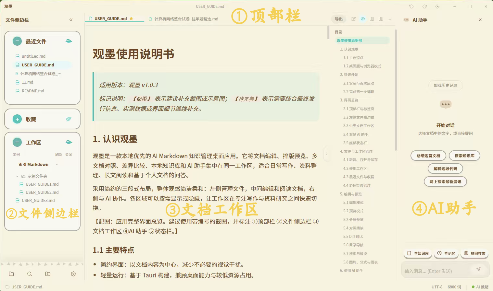

### 1.1 主要特点

- **简约界面**：以文档内容为中心，减少不必要的视觉干扰。
- **轻量运行**：基于 Tauri 构建，兼顾桌面能力与较低资源占用，日常使用内存占用约 10 MB。
- **多种视图**：支持编辑、预览、分屏预览、对照阅读和 Diff 对比等多种使用场景。
- **桌面集成**：支持设为默认 Markdown 应用，双击或拖拽 `.md` 文件即可快速打开。
- **本地优先**：文件、知识库索引、对话记录与长期记忆主要保存在本机。
- **AI 协作**：支持选区上下文、文件上下文、知识库查询、长期记忆与联网搜索。
- **个性外观**：提供暖色、浅色与深色三套主题，支持 AI 吉祥物头像、定制图标和定制光标。
- **GitHub 开源**：代码托管在 GitHub，支持社区驱动开发与贡献。

### 1.2 桌面版与浏览器模式

桌面版提供完整的本地文档管理能力，支持自动保存、AI 助手、知识库与长期记忆等完整功能。

你可以将观墨设置为默认 Markdown 应用。设置后，在文件管理器中双击 `.md` 文件即可直接用观墨打开；也可以将 Markdown 文件拖入观墨窗口，实现快速导入、阅读与编辑。

浏览器模式主要用于快速体验 Markdown 编辑与预览能力。由于浏览器环境存在 API Key 暴露风险，观墨在浏览器模式下禁止填写 API Key，因此 AI 助手、知识库、长期记忆等依赖 AI 或本地存储能力的功能将被禁用，并显示对应提示。

## 2. 快速开始

### 2.1 安装与首次启动

> **支持平台**
>
> * ✅ **Windows**：提供安装包，推荐下载最新版进行安装。
> * 🚧 **macOS**：暂未提供安装包，后续版本将视开发计划支持。
> * 🌐 **浏览器模式**：无需安装，可直接体验 Markdown 编辑与预览功能（部分桌面功能和 AI 功能不可用）。

**下载方式：**

- 前往 [GitHub Releases](https://github.com/we-used-to-be/Guanmo-open/releases) 下载最新桌面版安装包。
- 或访问 [在线体验页](https://we-used-to-be.github.io/Guanmo-page/) 直接使用浏览器模式。

安装完成后：

1. 启动观墨，进入主界面。
2. 选择“打开文件”读取单个 Markdown 文档，或选择“打开工作区”管理整个文件夹。
3. 根据需要进入“设置”，配置主题、编辑器和 AI 服务。
4. 开始创建或编辑你的 Markdown 文档。

## 3. 界面总览

### 3.1 顶部栏与标签页

顶部栏用于管理当前打开的文档和切换工作模式以及执行文档导出。未保存的文档会显示状态提示（小蓝点）。

【配图：顶部栏展示。】

【配图：右键标签执行更多操作】
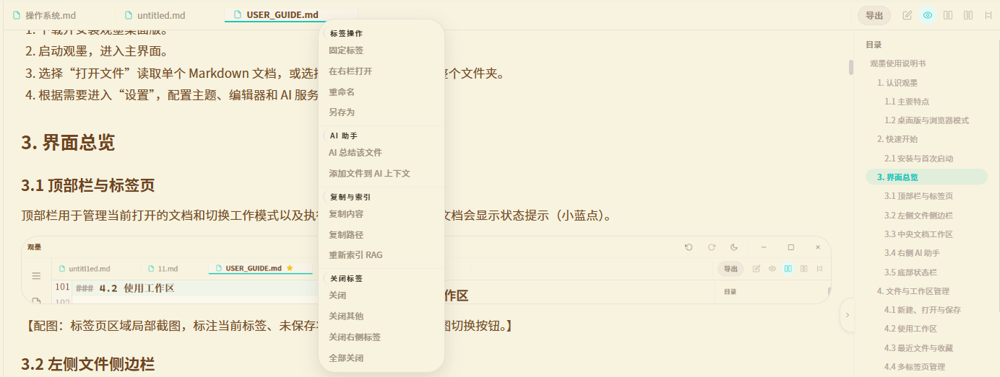

### 3.2 左侧文件侧边栏

文件侧边栏用于快速定位和打开本地文档，主要包括：

- 最近文件：显示近期打开过的文件。
- 收藏：集中显示已收藏的常用文件。
- 工作区：以文件树形式展示用户明确打开的目录。
- 搜索：在当前打开的文件中查找/替换内容，对应`Ctrl+F`。

打开工作区后，可以展开目录并点击文件名打开文档。通过文件或目录的右键菜单，还可以执行与当前对象相关的操作。

按 `Ctrl+B` 可以显示或隐藏侧边栏。

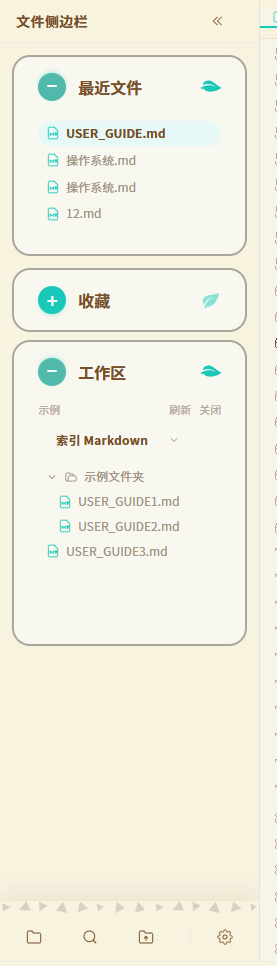

### 3.3 中央文档工作区

中央区域是主要的编辑与阅读空间。观墨支持 GFM Markdown、代码高亮、任务列表、数学公式和 Mermaid 图表，并可在编辑区插入、粘贴或拖入图片。

顶部栏右侧的模式按钮用于切换不同视图；预览区右侧的目录可以根据文档标题自动生成，点击标题即可快速跳转。

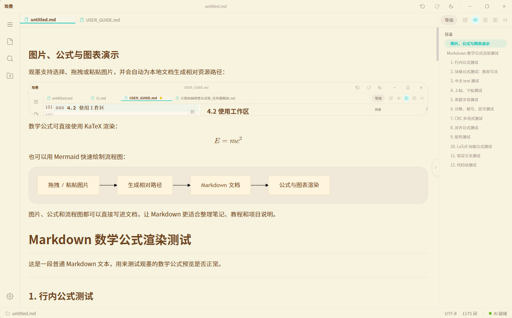

### 3.4 右侧 AI 助手

AI 助手用于对话、解释、总结、查询资料和辅助修改文档。它既可以处理普通问题，检索已入库的文件内容，也可以读取用户主动添加的选区、选区上下文和文件。

按 `Ctrl+J` 可以显示或隐藏 AI 面板。

### 3.5 底部状态栏

底部状态栏用于显示当前文档名字、字数和AI服务状态。配置 AI、Embedding 或联网搜索后，可通过状态提示判断相关服务是否可用。

### 3.6 全屏专注模式

按 `F11` 可进入全屏专注模式，适合沉浸式写作、阅读与对照。

全屏模式特点：
- 鼠标移至顶部唤起独立控制条
- 可快速切换编辑 / 预览 / Diff 视图
- 通过"标签 / 文件"或 `Ctrl+B` 打开全屏文件侧边栏
- AI 助手改为小窗模式，拖动顶部调节位置，点击外部关闭弹窗

【配图：全屏专注模式界面】

## 4. 文件与工作区管理

### 4.1 新建、打开与保存

- 新建文件：按 `Ctrl+N`。
- 打开文件：按 `Ctrl+O`。
- 保存当前文件：按 `Ctrl+S`。
- 另存为：通过文件相关菜单执行。
- 导出 HTML/PDF：按 `Ctrl+Shift+E/F`，或点击顶部的“导出”。

观墨的文件访问范围由用户主动选择的工作区或单个文件决定。未授权路径不会自动开放给应用或 AI。

### 4.2 使用工作区

工作区适合管理同一项目或主题下的多个文档。打开目录后，侧边栏会构建文件树，并过滤不适合直接阅读的非文本文件或大型目录。

建议将同一主题的 Markdown 文档放在独立目录中，再将该目录作为工作区打开。这样既方便文件导航，也便于建立本地知识库索引。

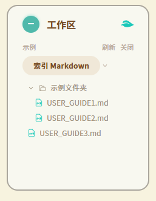

### 4.3 最近文件与收藏

“最近文件”用于快速返回近期文档；“收藏”用于固定长期使用的文件。文件被移动或删除后，原记录可能失效，此时可以从列表中移除记录。

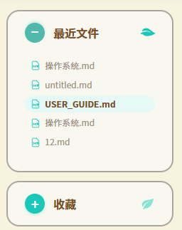

### 4.4 多标签页管理

打开多个文件后，可以通过顶部标签页在文档之间切换。

在对照阅读模式下，可以将标签页右键添加到右侧预览区域。

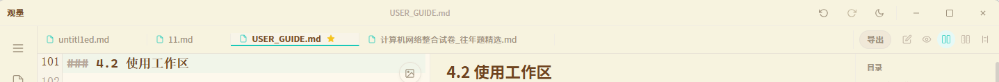

## 5. 编辑与预览

### 5.1 编辑模式

编辑模式只显示 Markdown 源文档，适合专注输入和大范围修改。编辑器支持行号、自动换行、搜索替换，以及常用 Markdown 编辑操作。

按 `Ctrl+Shift+1` 切换到编辑模式。

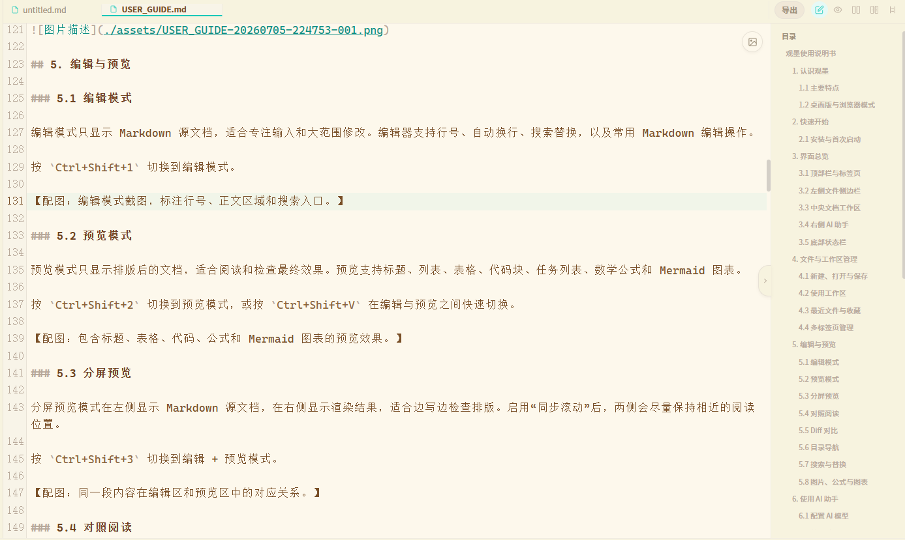

### 5.2 预览模式

预览模式只显示排版后的文档，适合阅读和检查最终效果。预览支持标题、图片、列表、表格、代码块、任务列表、数学公式和 Mermaid 图表。

按 `Ctrl+Shift+2` 切换到预览模式，或按 `Ctrl+Shift+V` 在编辑与预览之间快速切换。

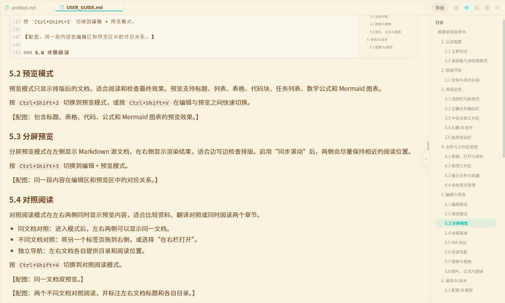

### 5.3 分屏预览

分屏预览模式支持同步更新，在左侧显示 Markdown 源文档，在右侧显示渲染结果，适合边写边检查排版。启用“同步滚动”后，两侧会尽量保持相近的阅读位置。

按 `Ctrl+Shift+3` 切换到编辑 + 预览模式。

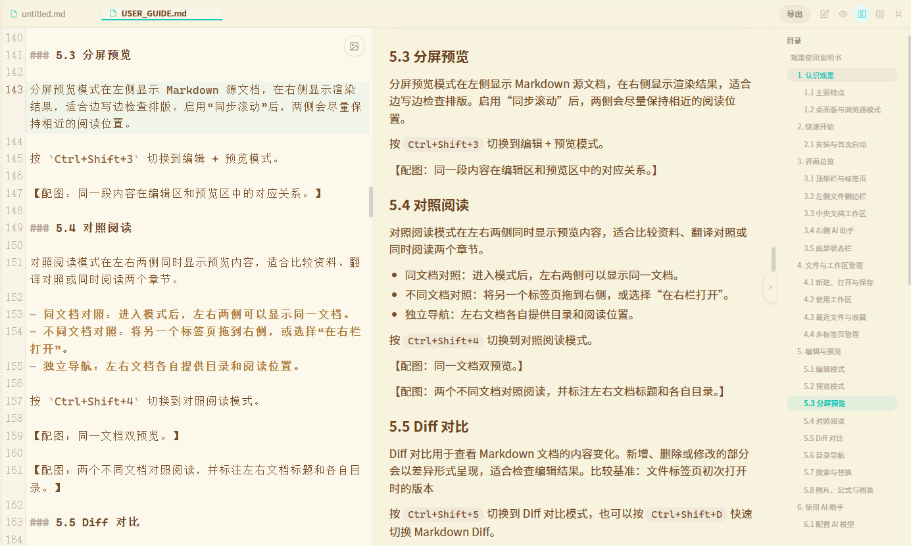

### 5.4 对照阅读

对照阅读模式在左右两侧同时显示预览内容，适合比较资料、翻译对照或同时阅读两个章节。

- 同文档对照：进入模式后，左右两侧可以显示同一文档。
- 不同文档对照：将另一个标签页右键选择“在右栏打开”。
- 独立导航：左右文档各自提供目录和阅读位置。

按 `Ctrl+Shift+4` 切换到对照阅读模式。

【配图：同一文档双预览。】

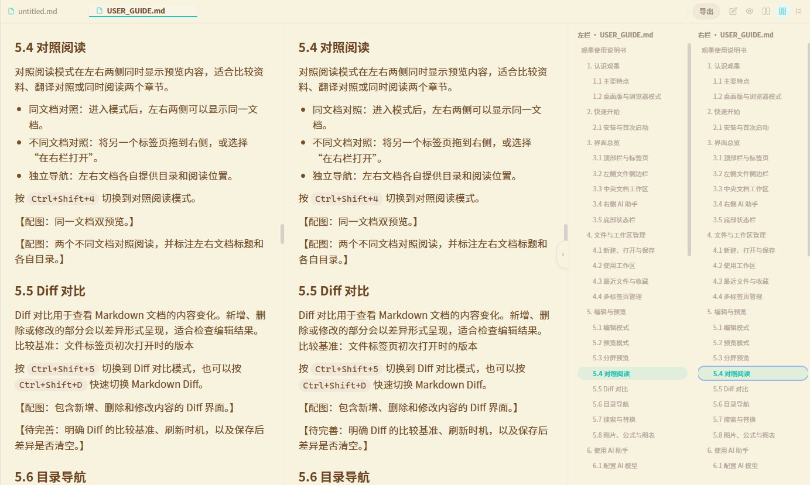

【配图：两个不同文档对照阅读。】

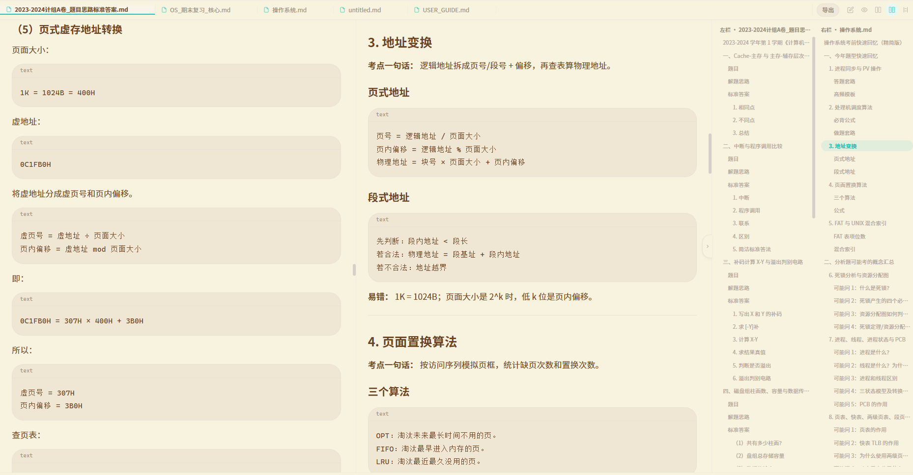

> 💡 小贴士：很适合左侧放题目右侧放答案或者解题思路提升学习效率

### 5.5 Diff 对比

Diff 对比用于查看 Markdown 文档的内容变化。新增、删除或修改的部分会以差异形式呈现，适合检查编辑结果。比较基准：文件标签页初次打开时的版本

按 `Ctrl+Shift+5` 切换到 Diff 对比模式，也可以按 `Ctrl+Shift+D` 快速切换 Markdown Diff。

【配图：包含新增、删除和修改内容的 Diff 界面。】
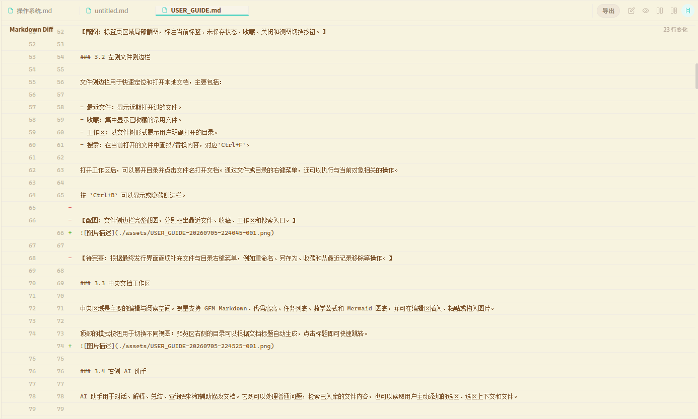

### 5.6 目录导航

预览区会根据 Markdown 标题自动生成目录。点击目录项可以跳转到对应章节。

目录可按需收起，为正文留出更多空间。对照阅读模式下，左右文档分别拥有独立目录。

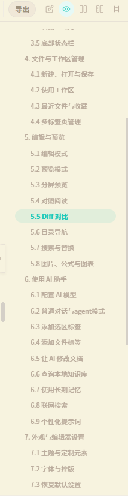

### 5.7 搜索与替换

按 `Ctrl+F` 打开当前文档的搜索功能。输入关键词后，可以在匹配结果之间前后跳转；需要批量修改时，可使用替换功能（仅在包含编辑区的模式下显示）。

【配图：搜索。】

【配图：搜索替换】

### 5.8 图片、公式与图表

观墨支持选择、拖拽或粘贴图片，并为本地文档生成相对资源路径。数学公式由 KaTeX 渲染，流程图等图表可使用 Mermaid 语法编写。

## 6. 使用 AI 助手

### 6.1 配置 AI 模型

首次使用前，进入“设置 → AI 模型”，完成以下配置：

1. 选择服务预设，或填写 OpenAI-compatible API 地址。
2. 如果使用在线服务，填写 API Key。
3. 填写对话模型名称。
4. 根据需要调整创造性、流式输出和联网搜索。

API Key 会通过系统安全存储保存，不写入普通设置；浏览器模式出于安全考虑，不提供AI服务。

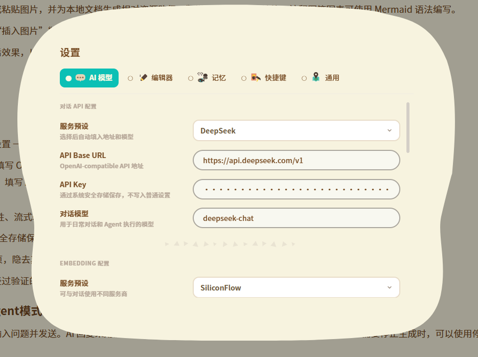

### 6.2 普通对话与 Agent 模式

在右侧输入框中直接输入问题并发送。AI 回复采用流式显示；执行查询或工具操作时，面板会展示执行时间线。需要停止生成时，可以使用停止按钮。

AI 通过**规则打分机制**决定请求是否进入 Agent 模式，以及调用什么能力。Agent 能力包含：阅读选区及其上下文、阅读文件、修改选区内容并生成修改确认卡片、调用知识库、调用记忆库、联网搜索。

涉及文件总结、解释、修改等需要文件具体内容的请求，需添加对应文本选区/文件标签（右键菜单添加）

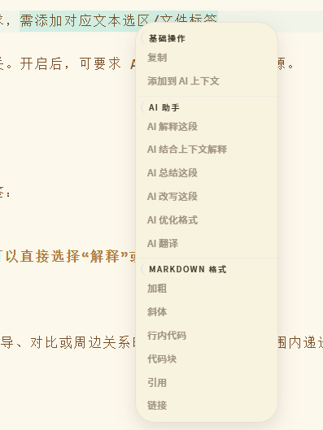

输入框上方提供知识库、长期记忆和联网搜索能力开关。开启后，可要求 AI **强制**使用对应数据源。

### 6.3 添加选区标签

当问题只针对文档中的一段内容时，建议使用选区标签：

1. 在编辑区或预览区框选目标文本。
2. 打开右键菜单，将选区添加到 AI 上下文；也可以直接选择“解释”或“修改”等快捷操作。
3. 确认输入框附近出现选区标签。
4. 输入具体要求并发送。

选区正文会作为本轮上下文提供给 AI。涉及原因、推导、对比或周边关系时，AI 可以在授权范围内递进读取附近的语义上下文，而不是默认读取全文。

选区右键菜单提供了多种AI快捷操作，均可一键发送请求：

- **AI解释这段**、**AI总结**、**AI翻译**：不命中 Agent，快速回复
- **AI结合上下文解释**：命中阅读上下文工具，自动读取关联上下文，更好的回答问题
- **AI改写这段**、**AI优化格式**：命中文档修改工具，快捷优化选文表达 / Markdown 格式

【配图：框选文字后的右键菜单。】

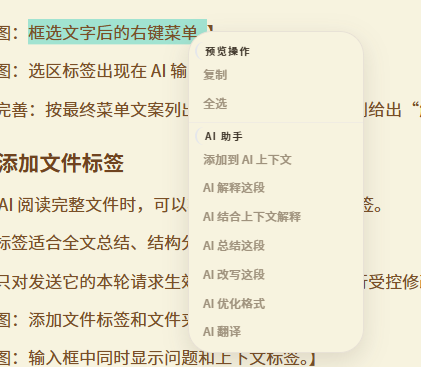

【配图：对选区标签进行提问，根据意图自动选择是否阅读相关上下文。】

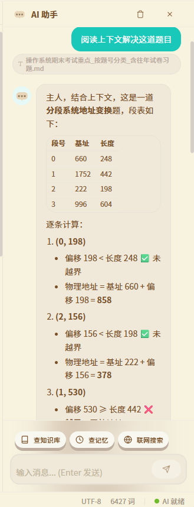

### 6.4 添加文件标签

需要 AI 阅读完整文件时，可以将文件添加为上下文标签。

文件标签适合全文总结、结构分析。

标签只对发送它的本轮请求生效。发送后如需继续进行受控修改，请重新添加目标标签。

【配图：添加文件标签的入口。】

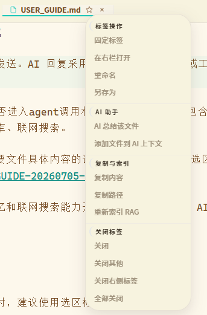

【配图：AI对文件进行总结】

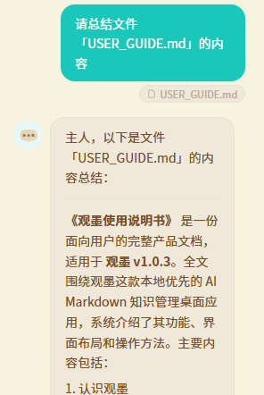

### 6.5 让 AI 修改文档

为避免误改文件，修改操作具有明确的授权和确认流程：

1. 框选要修改的文本并添加选区标签，或添加要修改的文件标签。
2. 本轮只保留一个修改目标。
3. 明确描述修改要求并发送。
4. AI 生成修改确认卡片。
5. 检查修改内容，确认后再应用到文档。
6. 支持撤回修改

如果本轮没有新的选区或文件标签，AI 不会直接修改文档。添加多个修改目标时，也不会自行选择其中一个。

框选文本右键菜单里面的“AI优化格式”能够一键让AI将框选文本变为标准 Markdown 格式，推荐使用。

【配图：选区右键选择”AI优化格式”】

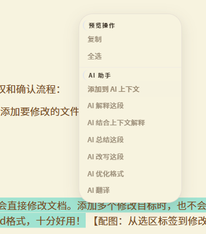

【配图：生成修改确认卡片，支持撤回修改】

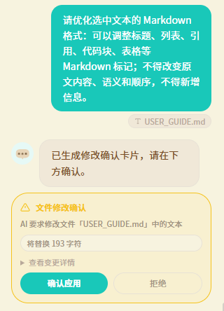

### 6.6 查询本地知识库

知识库会将打开过的文档按语义分块并生成向量索引。建立索引后，即使目标文件没有打开或没有添加为当前标签，AI 也可以搜索已索引内容。

首次使用步骤：

1. 在“设置 → AI 模型”中配置独立的 Embedding 服务。
2. 打开需要建立知识库的文件或工作区。
3. 在设置页面知识库区域查看文档、分块和嵌入状态。
4. 等待自动队列完成，或手动处理嵌入队列。
5. 在 AI 助手中提问，并开启知识库能力。

回答中的来源信息可以用于定位原文件和相关行，点击来源可直接跳转对应内容。知识库搜索返回的是相关片段；如果需要完整总结某篇文档，建议再添加对应文件标签。

【配图：知识库统计区域，标注文档数、分块数、已嵌入、待嵌入和队列状态。】

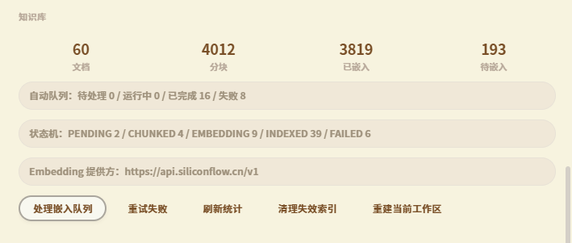

【配图：一次带来源信息的知识库问答，以及点击来源后定位原文的效果。】

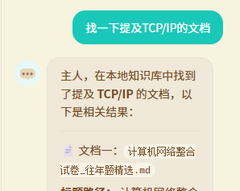

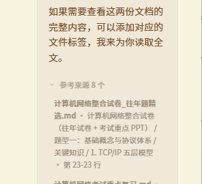

### 6.7 使用长期记忆

长期记忆用于保存稳定的个人偏好、项目约定和背景信息。AI 可以提取候选记忆，但候选内容需要用户确认后才会成为正式记忆。

你也可以明确告诉 AI”请记住……”，或在”设置 → 记忆”中手动创建和管理记忆。已保存的记忆支持分类、锁定、解锁和删除。

锁定适合保护不希望被后续整理流程影响的重要信息。删除记忆前，请确认该内容不再需要。

### 6.8 联网搜索

联网搜索适合查询新闻、最新资料或本地知识库之外的信息。

1. 进入“设置 → AI 模型”。
2. 开启“联网搜索”。
3. 选择 DuckDuckGo、Tavily、Serper、Brave Search 或自定义服务。
4. 按服务要求填写 API Key 或搜索地址。
5. 在 AI 面板开启联网搜索能力并提出问题。

联网结果可能随时间变化，重要信息应结合原始来源复核。

> 💡 Tavily 提供免费额度，注册后即可获取 API Key。

### 6.9 个性化提示词

在“设置 → AI 模型 → 用户偏好提示词”中，可以描述希望 AI 采用的语言、篇幅、结构和表达风格，例如：

> 每句回答都叫我“主人”

用户偏好提示词只影响回答风格和偏好，不会覆盖文件授权、修改确认、记忆写入等安全规则。

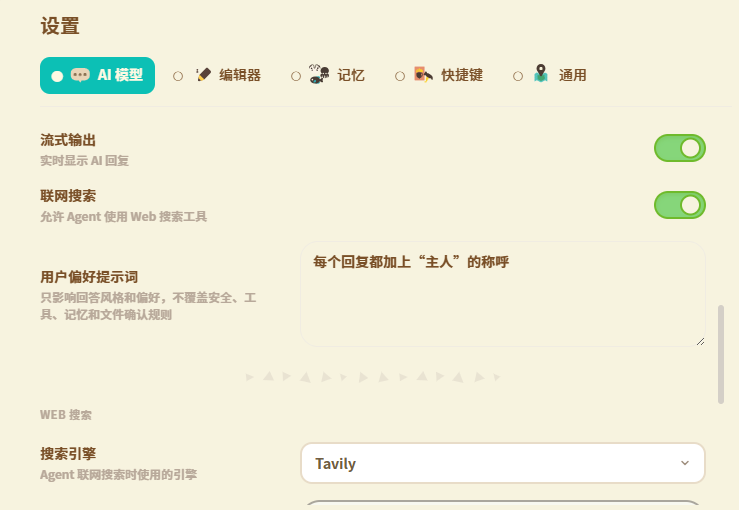

## 7. 外观与编辑器设置

### 7.1 主题与定制元素

观墨提供暖色、浅色与深色三套主题，可在标题栏或”设置 → 通用”中切换，无需重启。

- **暖色主题**：经典暖色调，适合长时间阅读。
- **浅色主题**：白色主题，视觉更清爽。
- **深色主题**：夜间写作配色，减少眼部疲劳。

按 `Ctrl+Shift+L` 或点击软件右上角主题快捷键，可在暖色/浅色与深色之间快速切换套装。

可启用或关闭定制光标（默认关闭）和 AI 吉祥物头像（默认关闭）。启用吉祥物头像后，AI 生成回复时会有”思考 - 写作”小动画。

【配图：暖色主题与深色主题】

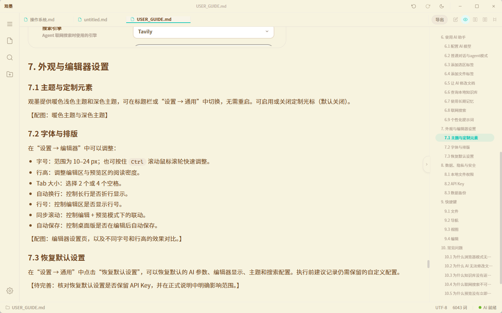

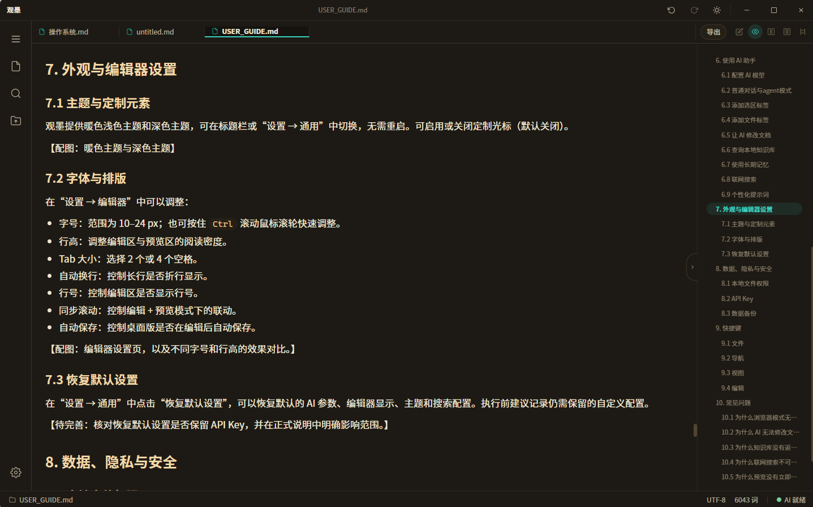

### 7.2 字体与排版

在“设置 → 编辑器”中可以调整：

- 字号：范围为 10–24 px；也可按住 `Ctrl` 滚动鼠标滚轮快速调整。
- 行高：调整编辑区与预览区的阅读密度。
- Tab 大小：选择 2 个或 4 个空格。
- 自动换行：控制长行是否折行显示。
- 行号：控制编辑区是否显示行号。
- 同步滚动：控制编辑 + 预览模式下的联动。
- 自动保存：控制桌面版是否在编辑后自动保存。

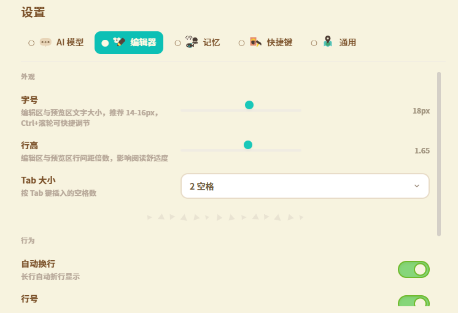

### 7.3 恢复默认设置

在“设置 → 通用”中点击“恢复默认设置”，可以恢复默认的 AI 参数、编辑器显示、主题和搜索配置。执行前建议记录仍需保留的自定义配置。

## 8. 数据、隐私与安全

### 8.1 本地文件权限

观墨仅访问用户通过文件对话框明确选择的工作区目录或单个文件。文件修改需要对应授权；AI 修改还需要本轮上下文标签和用户确认。

### 8.2 API Key

桌面版使用 Windows 系统加密能力保存 AI、Embedding 和 Web 搜索 API Key。普通数据备份不会包含这些敏感密钥。

### 8.3 数据备份

“设置 → 通用 → 数据管理”支持导出和导入普通数据备份。备份包含会话、消息和长期记忆，不包含 API Key；知识库索引可以在新设备重新打开工作区后重建。

## 9. 快捷键

### 9.1 文件

| 快捷键 | 功能 |
| --- | --- |
| `Ctrl+N` | 新建文件 |
| `Ctrl+O` | 打开文件 |
| `Ctrl+S` | 保存当前文件 |
| `Ctrl+Shift+E` | 导出当前文档为 HTML |
| `Ctrl+Shift+F` | 导出当前文档为 PDF |

### 9.2 导航

| 快捷键 | 功能 |
| --- | --- |
| `Ctrl+Shift+P` | 打开命令面板 |
| `Ctrl+,` | 打开设置 |
| `Ctrl+Tab` | 切换标签页 |

### 9.3 视图

| 快捷键 | 功能 |
| --- | --- |
| `Ctrl+B` | 显示或隐藏侧边栏 |
| `Ctrl+J` | 显示或隐藏 AI 面板 |
| `Ctrl+Shift+V` | 切换编辑/预览 |
| `Ctrl+Shift+D` | 切换 Markdown Diff |
| `Ctrl+Shift+1` | 切换到编辑模式 |
| `Ctrl+Shift+2` | 切换到预览模式 |
| `Ctrl+Shift+3` | 切换到分屏预览 |
| `Ctrl+Shift+4` | 切换到对照阅读 |
| `Ctrl+Shift+5` | 切换到 Diff 对比 |
| `Ctrl+滚轮` | 调整编辑器字号 |

### 9.4 编辑

| 快捷键 | 功能 |
| --- | --- |
| `Ctrl+F` | 搜索当前文档 |

当前版本支持查看快捷键，但暂不支持自定义改键。

【配图：设置中的快捷键总览页。】

## 10. 常见问题

### 10.1 为什么浏览器模式无法打开工作区或自动保存？

这些功能依赖桌面文件系统能力。请安装并使用桌面版。

### 10.2 为什么 AI 无法修改文档？

检查本轮消息是否添加了新的选区或文件标签，并确认只保留一个修改目标。修改内容还需要在确认卡片中批准后才会应用。

### 10.3 为什么知识库没有返回结果？

检查是否已配置 Embedding 服务、工作区文档是否完成分块与嵌入，以及知识库队列中是否存在失败任务。必要时重试失败任务或重建当前工作区索引。

### 10.4 为什么联网搜索不可用？

检查“联网搜索”总开关、搜索服务配置、API Key 和网络连接。DuckDuckGo 与其他搜索服务的配置要求不同。

### 10.5 为什么预览没有立即更新？

较大文档会适当延迟预览更新，以减少连续输入时的性能开销。停止输入后稍候片刻即可看到最新结果。

### 10.6 文件移动后，最近文件或收藏无法打开怎么办？

原路径已失效。请从列表中移除旧记录，再从新位置重新打开并收藏文件。

### 10.7 AI 生成的内容是否会自动写入文件？

不会。涉及文档修改时，观墨会生成确认卡片；只有用户确认后才会应用修改。重要内容仍建议保留独立备份并人工复核。

### 10.8 软件占用内存大吗？

软件基于 **Tauri** 开发，内存资源占用较小。日常使用占用内存约 **10MB** 左右（随实际使用情况变化）。

### 10.9 超长文档使用体验如何？

实测 **10 万字 Markdown 文档**：首次打开会稍慢一些，但加载完成后使用体验依然流畅，滚动、编辑、预览都没有明显卡顿。

---

